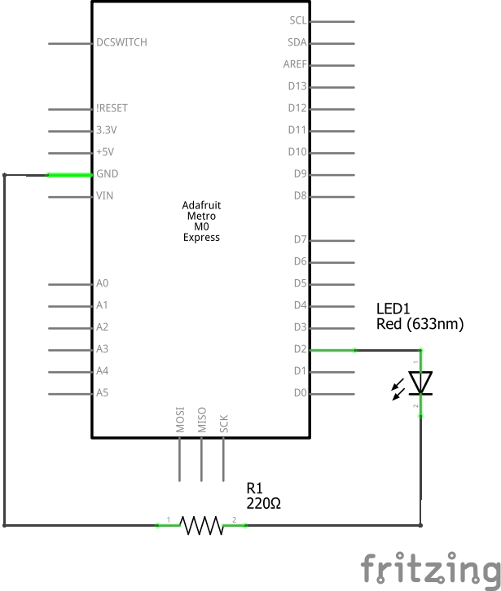
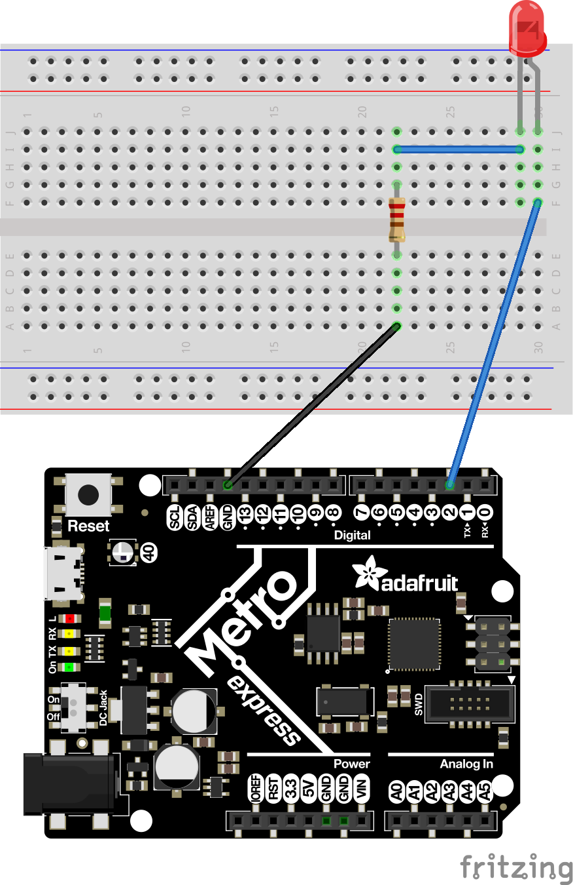

# CircuitPython
My CircuitPython assignments

## Hello CircuitPython (and Metro and Mu)
### Objective
New year, new programming language, new IDE, and new hardware.  This assignment was an introduction to the CircuitPython programming langauge, the Mu IDE, and the Metro M0 Express.  The Metro looks like an Arduino, but it is very different.  It runs CircuitPython.  And it also has a neopixel RGB LED built in.  This assignment was to code our new Metro to have an LED fade in and out.  
### Pictures
I'm still trying to figure out if I like the Fritzing breadboard or the Fritzing schematic better, so here's both.

### Methodology/Lessons
I completed this project by making a PWM object and varying the duty cycle.  PWM means Pulse Width Modulation.  A PWM signal is a square wave.  By varying the duty cycle (how often the pulse was up or down), I was able to vary the apparent brightness of the LED.  I made the PWM object like this: `led = pulseio.PWMOut(board.D3, duty_cycle=0, frequency=5000)` and then I changed the `duty_cycle` property.
#### PWM
From [this page](https://learn.adafruit.com/adafruit-metro-m0-express-designed-for-circuitpython/circuitpython-pwm), I learned that the Metro M0 Express has PWM on the following pins: A2, A3, A4, D0, RX, D1, TX, D2, D3, D4, D5, D6, D7, D8, D9, D10, D11, D12, D13, SDA, SCL, NEOPIXEL, SCK, MOSI, MISO.

There is NO PWM on: A0, A1, A5, FLASH_CS.
#### Analog Out
I also learned that the Metro M0 Express can do true analog, thanks to a DAC (digital to analog converter) on pin A0.

## CircuitPython Servo
## CircuitPython LCD
## CircuitPython Photointerrupters
## CircuitPython Distance Sensor
## Classes, Objects, and Modules
## Hello VS Code
## FancyLED
